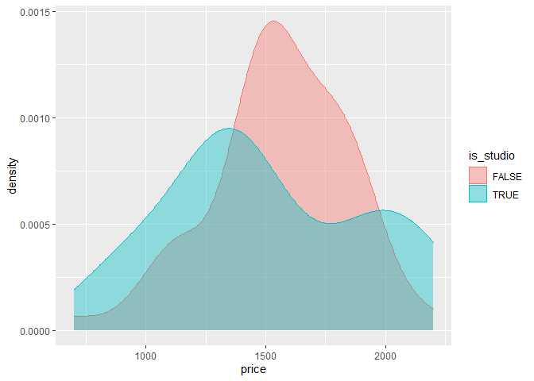

Clustering on Rental Properties Around Davis
================
Rishad Raiyan
3/17/2022

# Introduction

Finding a good place to live is a big challenge faced by every UC Davis
students on a regular basis. We attempt to make this decision easier for
them with the help of some Bayesian statistics. In this report, we
present recommendations based on clustering methods and provide data
visualization so renters can make an informed decision. The data for
rental apartments are collected from two different sites, Zillow and
Trulia. We compiled listings for three cities - Davis, Elk Grove &
Sacramento. All the steps in data collection, record linkage, data
clean-up, exploration and clustering are explained in details.

# Method

## Data Collection

### Collecting Data from Trulia

Trulia is Realtor website. It lists both houses for sale and rent.

A sample Scarping code plus the data clean-up steps are given below.

``` r
# Sample Code for Scrapping
## Davis Trulia Links
trulia_links_davis = sprintf("https://www.trulia.com/for_rent/Davis,CA/%d_p/", 1:2)
trulia_links_elk = sprintf("https://www.trulia.com/for_rent/Elk_Grove,CA/%d_p/", 1:2)
trulia_links_sac = sprintf("https://www.trulia.com/for_rent/Sacramento,CA/%d_p/", 1:16)

scraping_function = function(link){
  # Select Card Nodes
  card_nodes = read_html(link) %>%
    html_nodes("div[data-testid=property-card-details]")
  # House Area
  house_a = card_nodes %>%
    html_node("div > div > div[data-testid=property-floorSpace]") %>%
    html_text() %>% readr::parse_number()
  # Beds(With Ranges)
  beds = card_nodes %>%
    html_node("div > div > div[data-testid=property-beds]") %>% html_text() %>%
    str_remove_all("bd")
  # Baths(With Ranges)
  baths = card_nodes %>%
    html_node("div > div > div[data-testid=property-baths]") %>%
    html_text() %>%
    str_remove_all("ba")
  # Price(With Ranges)
  price = card_nodes %>%
    html_node("div > div > div[data-testid=property-price]") %>%
    html_text() %>%
    str_remove_all("\\$") %>%
    str_remove_all(",") %>%
    str_remove_all("/mo")
  # Separate the ranges, take care of Studio Apartments
  output = tibble(price = price, beds= beds, baths=baths, house_area = house_a) %>%
    separate_rows(price, beds, baths, sep="-", convert=TRUE) %>%
    mutate(is_studio = (beds == 'Studio')) %>%
    mutate(beds = replace(beds, beds=='Studio', 1))%>%
    mutate(beds=as.numeric(beds), price=as.numeric(price), baths=as.numeric(baths))
  # Take care of Semi-Bathrooms
  output = output %>%
    mutate(semi_bath = ((baths%%1) != 0)) %>%
    mutate(baths = floor(baths))
  return(output)
}

results_davis = purrr::map(trulia_links_davis, scraping_function )%>%
  bind_rows() %>%
  mutate(City = 'Davis')
results_elk = purrr::map(trulia_links_elk, scraping_function )%>%
  bind_rows() %>%
  mutate(City = 'Elk Grove')
results_sac = purrr::map(trulia_links_sac, scraping_function )%>%
  bind_rows() %>%
  mutate(City = 'Sacramento')

combined_trulia = bind_rows(results_davis, results_elk, results_sac)
```

Here, Some of the apartments are listed as Studio. This is given under
the number of bed rooms. The data was cleaned such that the number of
bedrooms for a studio is set to 1. Which is a reasonable simplification.
We also have a new variable is_studio per row, telling us if the listing
was in fact a studio apartment or a regular apartment.

Furthermore, some apartments had a range of listings in a single card.
The only way to reveal all the all the listings hidden beneath, is to go
into site for that listing and then do another round of web scrapping to
get the additional information. We tried doing this initially, but the
website’s anti-botting system blocked my code from running. So as a
work-around, each range of listings was split up into two separate
entries. One corresponding to the lower price point and the other
corresponding to the higher price point. For these entries, the number
beds/baths and the floor space also had a corresponding range. The data
was split up such that the lower price point corresponded to the lower
limit of beds, baths and floor space and the upper price point
corresponded to the upper limit. Although a little bit inaccurate, this
way at least we could gain some data rather than none. There might have
been some apartment listed in between those price points which we were
unable to scrap.

Some of the apartments had a bathroom listing as a fractional number.
For example, “1.5” or “2.5”. This corresponds to a semi-bathroom/single
sink somewhere in the house. We modified this as a completely separate
column called semi-bathroom. The actual number of bathrooms is listed in
the baths. With this modification, the number of beds is actually a
*floor* operation of the listed values.

A look at the first few data points of the final data is given below

    ## # A tibble: 10 x 7
    ##    price  beds baths house_area is_studio semi_bath City
    ##    <dbl> <dbl> <dbl>      <dbl> <lgl>     <lgl>     <chr>
    ##  1  1395     1     1         NA TRUE      FALSE     Davis
    ##  2  2175     2     2         NA FALSE     FALSE     Davis
    ##  3  2950     3     2       1200 FALSE     FALSE     Davis
    ##  4  2100     2     1         NA FALSE     FALSE     Davis
    ##  5  1495     1     1        600 FALSE     FALSE     Davis
    ##  6  3000     3     2       1428 FALSE     FALSE     Davis
    ##  7  3295     3     2       1540 FALSE     TRUE      Davis
    ##  8  1995     2     1        900 FALSE     FALSE     Davis
    ##  9  3800     4     2       1733 FALSE     FALSE     Davis
    ## 10  3350     3     2       1783 FALSE     TRUE      Davis

A simple summary of the data is also given below.

    ## # A tibble: 16 x 4
    ## # Groups:   City [3]
    ##    City        beds mean_rent mean_house_area
    ##    <chr>      <dbl>     <dbl>           <dbl>
    ##  1 Davis          1     1610.            537.
    ##  2 Davis          2     2123.            885.
    ##  3 Davis          3     3010.           1408.
    ##  4 Davis          4     3490            1763.
    ##  5 Davis          5     4233.           2137.
    ##  6 Elk Grove      1     1735.            594
    ##  7 Elk Grove      2     1821.            871.
    ##  8 Elk Grove      3     2631.           1614.
    ##  9 Elk Grove      4     2922.           2152.
    ## 10 Elk Grove      5     3788            3196.
    ## 11 Elk Grove      6     5995            3711
    ## 12 Sacramento     1     1513.            644.
    ## 13 Sacramento     2     2053.            976.
    ## 14 Sacramento     3     2511.           1470.
    ## 15 Sacramento     4     2918.           2075.
    ## 16 Sacramento     5     3295            2626

### Collecting Data From Zillow

Zillow is another famous Realtor website. It also has a wide listing of
rentals available.

The code for scrapping data from the zillow site is given below

``` r
zillow_links_davis = "https://www.zillow.com/davis-ca/apartments/"
zillow_links_elk = "https://www.zillow.com/elk-grove-ca/apartments/"
zillow_links_sac = sprintf("https://www.zillow.com/sacramento-ca/apartments/%d_p", 1:7)

scraping_function2 = function(link){
  # select houses
  houses <- read_html(link) %>%
    html_nodes(".photo-cards li article")
  z_id <- houses %>%
    html_attr("id")
  # address
  address <- houses %>%
    html_node(".list-card-addr") %>%
    html_text()
  # price
  price <- houses %>%
    html_node(".list-card-price") %>%
    html_text() %>%
    readr::parse_number()
  # info
  params <- houses %>%
    html_node(".list-card-info") %>%
    html_text2()
  # Studio
  is_studio = params %>% str_detect('[Ss]tudio')
  # number of bedrooms
  beds <- params %>%
    str_extract("\\d+(?=\\s*bds)") %>%
    as.numeric()
  # number of bathrooms
  baths <- params %>%
    str_extract("\\d+(?=\\s*ba)") %>%
    as.numeric()
  # total square footage
  house_a <- params %>%
    str_extract("[0-9,]+(?=\\s*sqft)") %>%
    str_replace(",", "") %>%
    as.numeric()

  tibble(price = price, beds= beds, baths=baths, house_area = house_a, is_studio=is_studio)
}

results_davis = purrr::map(zillow_links_davis, scraping_function2 )%>%
  bind_rows() %>%
  mutate(City = 'Davis')
results_elk = purrr::map(zillow_links_elk, scraping_function2 )%>%
  bind_rows() %>%
  mutate(City = 'Elk Grove')
results_sac = purrr::map(zillow_links_sac, scraping_function2 )%>%
  bind_rows() %>%
  mutate(City = 'Sacramento')

combined_zillow = bind_rows(results_davis, results_elk, results_sac)
```

The final data from zillow

    ## # A tibble: 10 x 7
    ##    price  beds baths house_area is_studio City  semi_bath
    ##    <dbl> <dbl> <dbl>      <dbl> <lgl>     <chr> <lgl>    
    ##  1   925    NA     1        150 TRUE      Davis FALSE    
    ##  2  1850     2    NA         NA FALSE     Davis FALSE    
    ##  3  1915     2    NA         NA FALSE     Davis FALSE    
    ##  4  1850    NA     1        800 FALSE     Davis FALSE    
    ##  5  3205     3    NA         NA FALSE     Davis FALSE    
    ##  6  3161     2     2       1311 FALSE     Davis FALSE    
    ##  7  1983     2     2        837 FALSE     Davis FALSE    
    ##  8  2100     2     1         NA FALSE     Davis FALSE    
    ##  9  1475     2    NA         NA FALSE     Davis FALSE    
    ## 10    NA    NA    NA         NA FALSE     Davis FALSE

One thing to notice is that in the zillow site never lists
semi-bathrooms. Which makes it harder to combine data between these two
datasets. Looking at the data from the Trulia site, it is apparent that
most rentals do not have semi-baths. Apartments with a semi-bath is
55/359 = 0.15 = 15. To make it easier to merge these two datasets, we
assume that none of the apartments from the Zillow listing have
semi-baths.

We can get some similar statistics about this dataset. It is shown below

    ## `summarise()` has grouped output by 'City'. You can override using the `.groups` argument.

    ## # A tibble: 12 x 4
    ## # Groups:   City [3]
    ##    City        beds mean_rent mean_house_area
    ##    <chr>      <dbl>     <dbl>           <dbl>
    ##  1 Davis          2     2081.           1074
    ##  2 Davis          3     3205             NaN
    ##  3 Davis         NA     1388.            475
    ##  4 Elk Grove      2     1999.            756
    ##  5 Elk Grove      3     3000            1398.
    ##  6 Elk Grove      4     2800            1727
    ##  7 Elk Grove      5     2895            2617
    ##  8 Elk Grove     NA     1545             588
    ##  9 Sacramento     2     1907.            902.
    ## 10 Sacramento     3     1895            1092
    ## 11 Sacramento     4     1995            1505
    ## 12 Sacramento    NA     1545.            698.

This summary reveals to us that this dataset has a bunch of rows where
even the price of the rental is not listed on the website. We discard
these rows from our final data.

## Data Exploration

Once we have the combined data from both sites, we can move on to
figuring out patterns with the data.

When choosing an apparent, first thing a person needs to decide on is
the number of bedrooms or the size of the apartment. Depending on if
they are living alone, with friends or with family - the requirements
will be different. The second most important issues will be the rent and
the distance from university. We start looking at this data by plotting
these variables using ‘GGPLOT2’

    ## Warning: Removed 138 rows containing missing values (geom_point).

<!-- -->
Unsurprisingly, rent of the houses go up with the square feet of the
house. So does the number of bedrooms. This plot has very few outliers.

We can make the same plot for number of baths instead of bedrooms.

    ## Warning: Removed 119 rows containing missing values (geom_point).

<!-- --> These two
plots are pretty similar.

It is pretty evident that houses in Davis are just in general costlier
than both Sacramento and Elk Grove. If we would have taken other towns
close to Davis, for example Dixon or Woodland, we would still see a
pretty similar pattern. This kind of allows to classify if a house
belongs in Davis or somewhere else just by seeing its rent vs. house
size.

Another interesting thing to look at is the price-per-sq. feet
distribution at different cities.

    ## Warning: Removed 119 rows containing non-finite values (stat_density).

<!-- -->

We can also look at the difference in rent between Studio apartments and
single bedroom apartments. Realistically, these two types of houses will
be of interest to the same demographic of people. Interestingly enough,
the rent for studio apartments are lower than their single bedroom
counterpart.
<!-- --> We would
have like to do a plot showing the price vs. area for these two types of
apartments. However, for most of the studio apartments, the area is
missing. This might point to some strange phenomena where renters do not
like listing the size of their studio apartments. Or it could be just
that the data we have co-incidentally is like this. Considering we are
working with a relatively small sample of data, the later is not
unlikely.

We can also look at the availability of houses at a certain price point
at each city. This gives a general idea about which types of houses are
more common in a specific place. This information can come in handy to
someone who’s trying to decide which city to live in during. It can
answer questions like is it cheaper to stay in a different town and
commute to Davis or just stay in Davis despite a higher rent.
<!-- -->

    ## Warning: Removed 1 rows containing non-finite values (stat_density).

<!-- -->

<!-- --> It looks
like in general, there are more cheaper options available in Sacramento
& Elk Grove compared to Davis.

Based on these information, for fitting purposes, we change the *City*
variable to factors. With Davis being the highest and Elk Grove being
the lowest level.

## Clustering

In this section, we want to look into clustering to determine if we can
offer the user other houses similar to the ones they are already looking
at.

### K-Means Clustering

Before we go into Bayesian methods, we want to explore K-means
clustering. This gives us more information about the data and what sort
of clustering would make sense. The knowledge we gain from here can
later be used in Bayesian clustering to give us an edge.

First we need to choose a K i.e. the number of clusters for the
algorithm. This is done by determining WSS for different values of K. We
plot K for fitting price and size of each house down below.

<!-- --> From this
plot, it makes sense to choose $ K = 5 $ for clustering. At least in
terms of the K-Means clustering. We plot the centers.

<!-- -->

We repeat the same process, but this time taking all the columns into
consideration.

<!-- -->

Even for this approach, we get similar best K at 5. The cluster means
are given below

    ##       beds    baths house_area    price
    ## 1 1.500000 1.027778   681.2222 1421.056
    ## 2 3.753846 2.369231  2045.5231 3180.985
    ## 3 2.000000 1.203125   910.4844 1945.250
    ## 4 2.973684 2.035088  1394.9035 2525.544
    ## 5 4.200000 3.000000  3343.2000 4374.000

## Bayesian Approach

We now shift our focus to a Bayesian approach. Before we can start
clustering, we need to determine what sort of variance-covariance matrix
would work best for this approach. After this step, we retry different
values of K and check their respective BICs. The final model with this
new K and variance-covariance matrix is chosen as our clustering
algorithm.

Before moving on, we actually tried clustering for all the variables
available. The clustering algorithm seemed to fail for some of the
cases. Which is why we decided to focus only on the price and the
house_area.

Looking at the cluster centers and the data, it is reasonable to assume
the clusters should be ellipsoidal. We only check out the BIC for these
forms. We fit the models and print out the results below.

``` r
mat_types = c('EEE', 'EVE', 'VEE', 'EEV', 'VVE', 'EVV', 'VEV', 'VVV')
all_BIC = list()
for (mat_type in mat_types){
  df.Mclust2 <- Mclust (combined %>% dplyr::select(price, house_area) %>%
                          drop_na(), model=mat_type, G=5)
  print(paste(mat_type, " BIC = ", df.Mclust2$BIC))
}
```

    ## [1] "EEE  BIC =  -9447.48728097747"
    ## [1] "EVE  BIC =  -9457.02976023343"
    ## [1] "VEE  BIC =  -9408.58667334947"
    ## [1] "EEV  BIC =  -9438.79215620533"
    ## [1] "VVE  BIC =  -9428.27307914882"
    ## [1] "EVV  BIC =  -9451.6219965255"
    ## [1] "VEV  BIC =  -9420.60063823679"
    ## [1] "VVV  BIC =  -9430.69014906612"

“VEV” Seems to give us the better BIC from the fitting.

Next we try out different K values and plot the corresponding BICs.

``` r
all_BIC = list()
for (k in seq(1, 10)){
  df.Mclust2 <- Mclust (combined %>% dplyr::select(price, house_area,) %>%
                          drop_na(), model="VEV", G=k)
  all_BIC = c(all_BIC, df.Mclust2$BIC[1])
}
```

<!-- --> This plot
actually seems to suggest K = 4 is a better for for the given data.
(Take into account that these clusters are made with only 2 parameters,
the area of the house and the price taken into consideration).

Next we apply expectation maximization algorithm on this.

<!-- -->

Plotting the only best one,

<!-- -->

We also wanted to look at the clustering for *K* = 5. AS that was the
value suggested by our frequentist analysis.

<!-- -->

It is pretty evident that the likelihood values for $ K =5$ is in
general larger than *K* = 4. So for this context, *K* = 4 was the better
option.

Finally we plot the uncertainty for our estimations.

<!-- -->

# Conclusion

In this report, we provide visualizations and recommendations for future
renters. We aim to provide them logistical data about rent, house
specifications and availability to make informed decisions before
picking an apartment.

In the report, we show the different states of data collection, cleanup
and record linkage. Afterwards, we use the gathered data to make some
decision about the housing market in the area near Davis.For example, we
show that studio apartments are in general cheaper than one-bedroom ones
and that houses in Davis are on average more expensive than the cities
nearby. This trend is persists for all types of houses. We also provide
a clustering based recommendation system for checking out other similar
houses in a similar price point.
